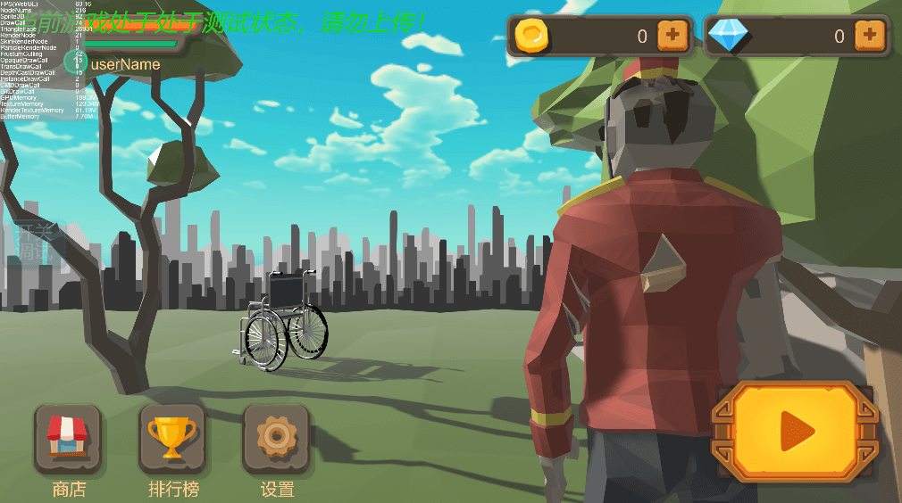
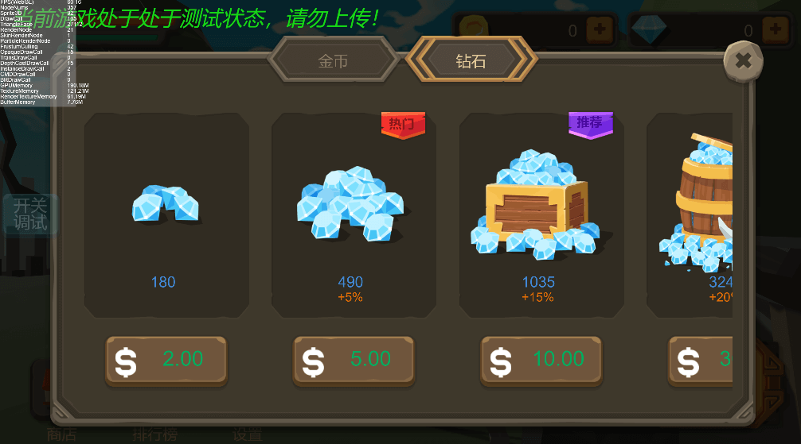
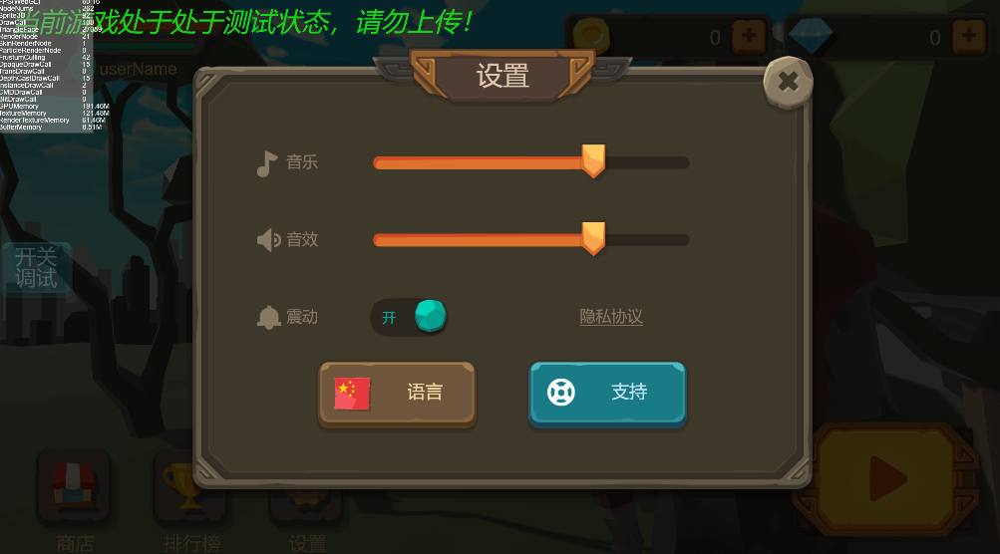
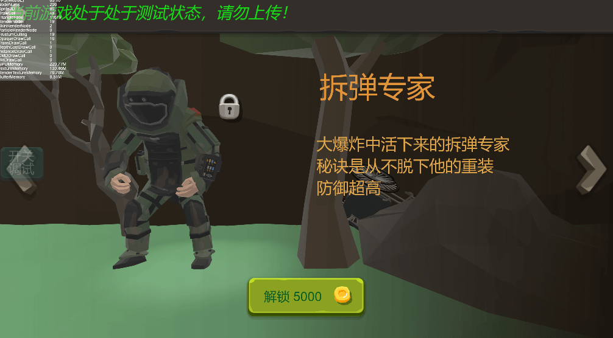
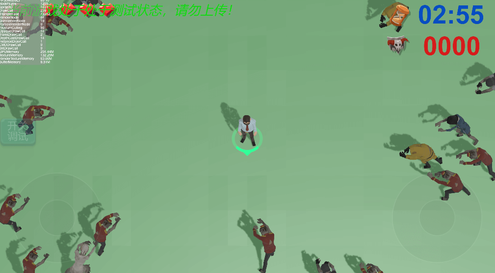

# WheelChairMan

$by NoRainLand$

2023/2/6

## 一个使用Laya3.0制作的小项目

### 主界面

### 商店

### 设置

### 选择人物

### 游戏

编程方面的细节可以查看src下的[README.md](./src/README.md)

关于Issue，我想我的代码肯定不会有人看不懂的，都是一些浅显的内容。当然，bug方面，我看到并且有空就改，需求就随缘了。

素材均为我自费购买，编程，界面为我独自完成。

## 游戏项目代码仅供学习交流，所有素材均为付费素材，禁止用于商业用途
